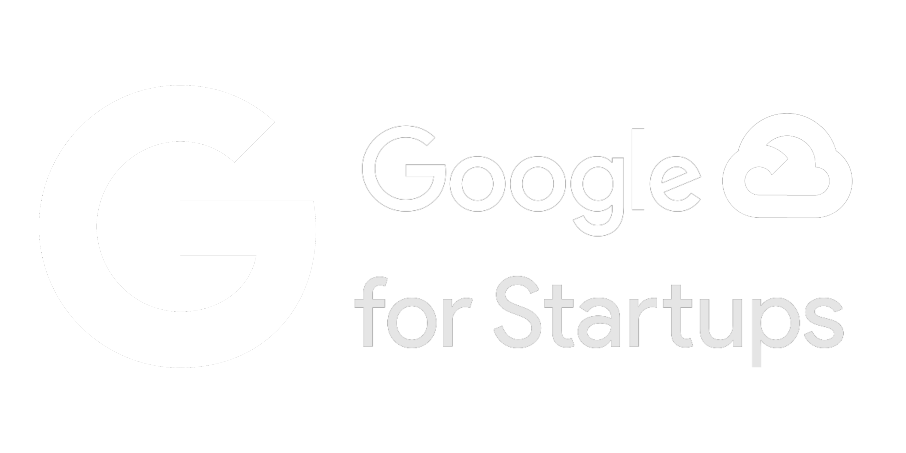
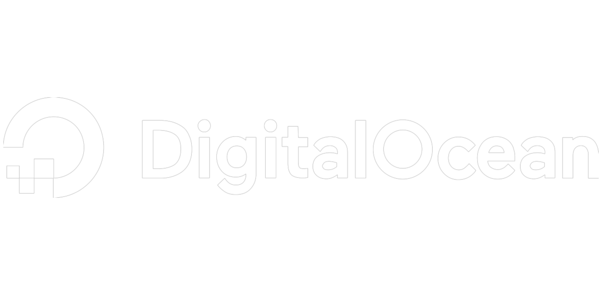
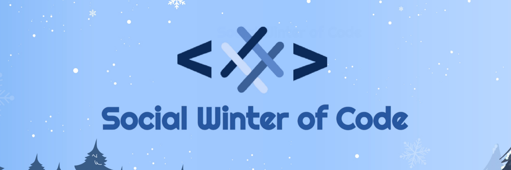
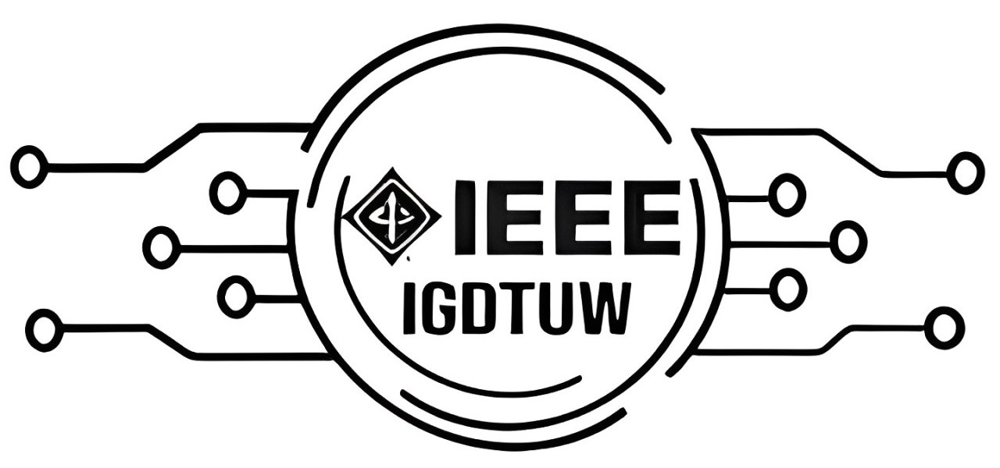
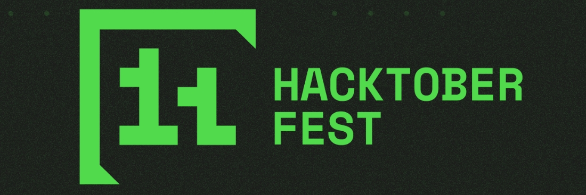
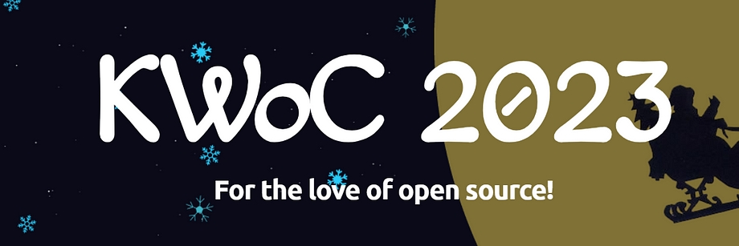

<h2></h2>

<!-- <table align="center">
     <thead align="center">
        <tr border: 2px;>
            <td><b>🌟 Stars</b></td>
            <td><b>💌 Forks</b></td>
            <td><b>🐛 Issues</b></td>
            <td><b>🔔 Open PRs</b></td>
            <td><b>🔕 Close PRs</b></td>
            <td><b>🌐 Contributors</b></td>
        </tr>
     </thead>
     <tbody>
         <tr>
            <td></td>
             <td></td>
            <td></td>
            <td></td>
           <td></td>
           <td></td>
        </tr>
    </tbody>
</table>  -->

  <!-- <h1 align="center"> Paradise For Developers </h1> -->

 
 

`The First Global Platform for Developers to Fulfill All Their Tech Needs.` 

<h2 align="center"> Connect ▸ Collab ▸ Code ▸ Create ▸ Conquer </h2>

  <!-- 

    
  Click here to explore your all-in-one destination for everything tech! 

     
  

| **⚡** | **One Place**                                               |
| ------ | ----------------------------------------------------------- |
| 🚀     | One platform to discover exceptional tech talent            |
| 🔗     | One platform to connect with passionate tech enthusiasts    |
| 🤝     | One platform to collaborate on groundbreaking ideas         |
| 🔧     | One platform to build innovative projects together          |
| 💡     | One platform to gain inspiration and ignite creativity      |
| 📚     | One platform to access all your tech resources in one place |
| 🌟     | One platform to find the latest opportunities in tech       |
| 💡     | One platform to turn your ideas into reality                |
| 🌍     | One platform to showcase your projects to the world         |
| 🎯     | One platform to highlight your skills and expertise         |
| 📣     | One platform to promote your work and gain visibility       |
| 📈     | One platform to learn, grow, and thrive with the community  |
| 💸     | One platform to earn rewards and monetize your skills       |
| 🎁     | One platform to get exclusive benefits as a tech enthusiast |

 -->

<h1 align="center">Supported By </h1>
<table>
  <tr>
    <td align="center">
      
    </td>
    <td align="center">
      
    </td>
    <td align="center">
      
    </td>
    <td align="center">
      
    </td>
    <td align="center">
      
    </td>
  </tr>
  <tr>
    <td align="center">
      
    </td>
    <td align="center">
      
    </td>
    <td align="center">
      
    </td>
    <td align="center">
      
    </td>
    <td align="center">
      
    </td>
  </tr>
</table>

  <h1>Connect with DevDisplay Organization </h1>

<table align="center">
     <thead>
         <tr>
            <td></td>
            <td></td>
           <!-- <td></td> -->
            <td></td>
            <td></td>
            <td></td>
        </tr>
    </thead>
     <tbody align="center">
        <tr border: 2px;>
            <td><b><a href="https://github.com/devdisplay"> GitHub </a></b></td>
            <td><b><a href="https://discord.gg/chyt2UgTv5"> Discord </a></b></td>
          <!--  <td><b><a href="https://chat.whatsapp.com/Dcl21sgGDIpHURESSuH0p4"> WA </a></b></td> -->
            <td><b><a href="https://www.linkedin.com/company/devdisplay/"> Linkedin </a></b></td>
            <td><b><a href="https://x.com/devdisplay_"> Twitter </a></b></td>
            <td><b><a href="https://www.instagram.com/devdisplay/"> Insta. </a></b></td>
        </tr>
     </tbody>
</table>

<!-- congrats  -->

     
<h1 align="center">Contribute to DevDisplay! </h1>
<h4 align="center">Leave Your Legacy. Record Your Name in Open Source History! Let's Contribute. Collaborate. Conquer.</h4>

<a href="https://drive.google.com/file/d/17Wh9xxN_SIeEVcejoSN7K7tUhWXPvSxR/view?usp=sharing" target="_blank" rel="noreferrer">View the 8 Benefits of Contributing to DevDisplay</a>

<table align="center">
  <tr>
    <td align="center" width="300" style="border: 2px solid #00ADEF; border-radius: 20px; padding: 10px;">
      <a href="https://github.com/codeaashu/DevDisplay/blob/main/CONTRIBUTING.md" target="_blank" style="text-decoration: none; color: #ffffff;">
         
        <strong style="font-size: 20px; color: #00ADEF;">Check Out The Contribution Details</strong>
      </a>
    </td>
  </tr>
</table>

<!--<h2 align="center">  We appreciate your support </h2>-->

<h1> DevDisplay Contributor Badges </h1>

|  |  |  |
| ------------------------------------------------------- | -------------------------------------------------------- | --------------------------------------------------------- |

<h2 align="center">How to Earn These Badges?  </h2>

 

<h1 align="center">Featured in </h1>
<table>

   <tr>
      <th>Program Logo</th>
      <th>Program Name</th>
      <th>Program Description</th>
   </tr>
   <tr>
      <td></td>
      <td><a href="https://gssoc.girlscript.tech/">GirlScript Summer of Code</a></td>
      <td>GirlScript Summer of Code is a three-month-long Open Source Program conducted every summer by GirlScript Foundation. It is an initiative to bring more beginners to Open-Source Software Development.</td>
   </tr>
   <tr>
      <td></td>
      <td><a href="https://www.socialwinterofcode.com/">Social Winter of Code</a></td>
      <td>Social Winter Of Code is the 2 month long open source program by Social India , with the aim to introduce more and more people to the world of Open source.</td>
   </tr>
   <tr>
      <td></td>
      <td><a href="https://ieee-igdtuw.github.io/IEEE-IGDTUW-Official-Website/">IEEE IGDTUW Open Source Week</a></td>
      <td>IEEE IGDTUW Open Source Week is a week-long event aimed at fostering collaboration and skill-building in open-source. Participants can work on impactful projects, learn version control, and gain real-world experience while contributing to open-source communities.</td>
    </tr>
    <tr>
      <td></td>
      <td><a href="https://hacktoberfest.com/">Hacktoberfest</a></td>
      <td>Hacktoberfest is a month-long virtual event that celebrates open-source software and encourages people to contribute to open-source projects</td>
   </tr>
   <tr>
      <td></td>
      <td><a href="https://www.tublian.com/internship">Tublian</a></td>
      <td>Tublian open source internship program lets software developers get real open source experience by collaborating with major open source projects.</td>
   </tr>
   <tr>
      <td></td>
      <td><a href="https://iwoc.codes/">Innogeeks Winter of Code</a></td>
      <td>Innogeeks Winter of Code is a month-long open-source program envisioned by the Innogeeks. It is an online initiative that introduces new contributors to open-source software development.</td>
   </tr>
      <tr>
      <td></td>
      <td><a href="https://kwoc.kossiitkgp.org/">Kharagpur Winter of Code</a></td>
      <td>Kharagpur Winter of Code is a 5-week long online program for students who are new to open source software development. The program not only helps students to get involved in open source, but also prepares them for many open source summer programs.</td>
   </tr>
</table>

 

<h1 align="center">Contributors</h1></h1>
<table>
<h3 align="center"> We appreciate your support ✦ Thank you for being a part of our global vision. </h3>

    

</table>

<h1 align="center"> Give us a Star and let's make magic! </h1>

<!--<h1 align="center"> Creator & Founder of DevDisplay </h1>

<h4 align="center"><a href="https://github.com/codeaashu">

</a> <a href="https://www.ashutoshkumar.me"><strong>Ashutosh Singh</strong></a>  

  
 A creative Full Stack Web Developer & Designer • Till now build 50+ WEB APP</h4>
 -->

<!-- <h1 align="center">© LICENSE </h1>-->

<!--<table align="center">
  <tr>
     <td>
       
 </img>
    </td>
    <td>
        
This project is licensed under <a href="./LICENSE">MIT</a>. 
    </td>
  </tr>
</table>-->

<!-- -->

     
     

