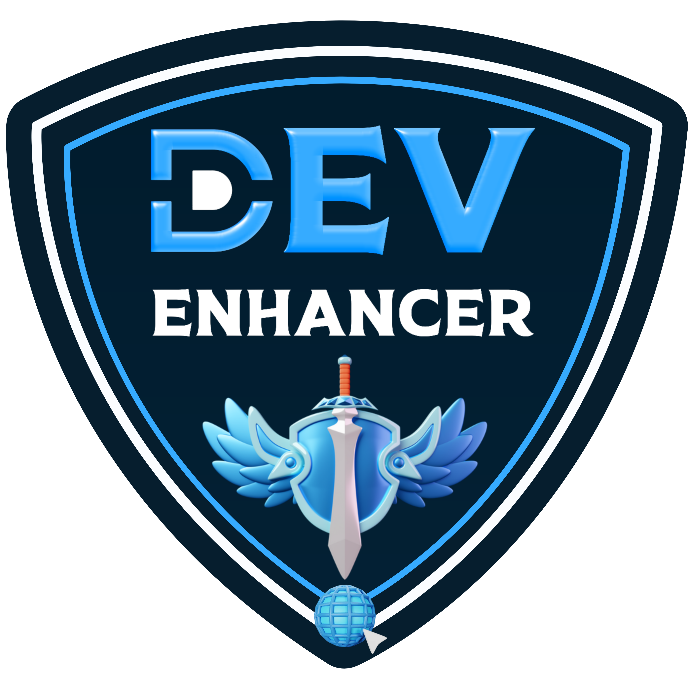

<div align="center">
<table align="center">
     <thead align="center">
        <tr border: 2px;>
            <td><b>🌟 Stars</b></td>
            <td><b>💌 Forks</b></td>
            <td><b>🐛 Issues</b></td>
            <td><b>🔔 Open PRs</b></td>
            <td><b>🔕 Close PRs</b></td>
            <td><b>🌐 Contributors</b></td>
        </tr>
     </thead>
     <tbody>
         <tr>
            <td></td>
             <td></td>
            <td></td>
            <td></td>
           <td></td>
           <td></td>
        </tr>
    </tbody>
</table><hr>

  <h1 align="center"> DevDisplay - Global Tech Hub </h1>
<a href="https://www.devdisplay.org/"></a>
<br><br>
  DevDisplay is a global open-source tech community and organization that brings together all your tech needs in one place.<br><br>

<details>
    <summary>  Click here to explore your all-in-one destination for everything tech! </summary>
<div align="center">     
 <br>

| **⚡** | **One Place**                                               |
| ------ | ----------------------------------------------------------- |
| 🚀     | One platform to discover exceptional tech talent            |
| 🔗     | One platform to connect with passionate tech enthusiasts    |
| 🤝     | One platform to collaborate on groundbreaking ideas         |
| 🔧     | One platform to build innovative projects together          |
| 💡     | One platform to gain inspiration and ignite creativity      |
| 📚     | One platform to access all your tech resources in one place |
| 🌟     | One platform to find the latest opportunities in tech       |
| 💡     | One platform to turn your ideas into reality                |
| 🌍     | One platform to showcase your projects to the world         |
| 🎯     | One platform to highlight your skills and expertise         |
| 📣     | One platform to promote your work and gain visibility       |
| 📈     | One platform to learn, grow, and thrive with the community  |
| 💸     | One platform to earn rewards and monetize your skills       |
| 🎁     | One platform to get exclusive benefits as a tech enthusiast |

</div>
</details>
</div><hr>

<div align="center">
<h1 align="center">Supported By </h1>
<table>
  <tr>
    <td align="center">
      <a href="https://www.microsoft.com/en-us/startups">
        
      </a>
    </td>
    <td align="center">
      <a href="https://msme.gov.in/">
        
      </a>
    </td>
    <td align="center">
      <a href="https://cloud.google.com/startup">
        
      </a>
    </td>
    <td align="center">
      <a href="https://devdisplay.vercel.app/">
        
      </a>
    </td>
    <td align="center">
      <a href="https://www.digitalocean.com/">
        
      </a>
    </td>
  </tr>
  <tr>
    <td align="center">
      <a href="https://www.producthunt.com/products/devdisplay">
        
      </a>
    </td>
    <td align="center">
      <a href="https://www.gitbook.com/">
        
      </a>
    </td>
    <td align="center">
      <a href="https://github.com/devdisplay/DevDisplay">
        
      </a>
    </td>
    <td align="center">
      <a href="https://www.notion.so/startups">
        
      </a>
    </td>
    <td align="center">
      <a href="https://peerlist.io/">
        
      </a>
    </td>
  </tr>
</table>

<a href="https://trendshift.io/repositories/12132" target="_blank"></a>

<a href="https://www.producthunt.com/posts/devdisplay?utm_source=badge-top-post-topic-badge&utm_medium=badge&utm_souce=badge-devdisplay" target="_blank"></a>
<a href="https://www.producthunt.com/posts/devdisplay?embed=true&utm_source=badge-featured&utm_medium=badge&utm_souce=badge-devdisplay" target="_blank"></a>
<a href="https://www.producthunt.com/posts/devdisplay?utm_source=badge-top-post-badge&utm_medium=badge&utm_souce=badge-devdisplay" target="_blank"></a>

</div><hr>

<div align="center">
  <h2>Connect with DevDisplay Organization </h2>
</div>
<table align="center">
     <thead>
         <tr>
            <td></td>
            <td></td>
            <td></td>
            <td></td>
            <td></td>
            <td></td>
        </tr>
    </thead>
     <tbody align="center">
        <tr border: 2px;>
            <td><b><a href="https://github.com/devdisplay"> GitHub </a></b></td>
            <td><b><a href="https://discord.gg/chyt2UgTv5"> Discord </a></b></td>
            <td><b><a href="https://chat.whatsapp.com/Dcl21sgGDIpHURESSuH0p4"> WA </a></b></td>
            <td><b><a href="https://www.linkedin.com/company/devdisplay/"> Linkedin </a></b></td>
            <td><b><a href="https://x.com/devdisplay"> Twitter </a></b></td>
            <td><b><a href="https://www.instagram.com/devdisplay/"> Insta. </a></b></td>
        </tr>
     </tbody>
</table></div><hr>
<div align="center">
<h1> DevDisplay Contributor Badges </h1>

|  |  |  |
| ---------------------------------------------------- | ----------------------------------------------------- | ------------------------------------------------------ |

</div>

<h2 align="center"> How to Earn These Badges </h2>

<p align="center">
  <strong> Dev Pioneer</strong><br>
  Add your profile to the DevDisplay platform.<br>
  <em>(Join the community by submitting a PR with your details.)</em>
</p>

<p align="center">
  <strong> Dev Enhancer</strong><br>
  Improve or refine existing features.<br>
  <em>(Submit a meaningful Pull Request that enhances the platform.)</em>
</p>

<p align="center">
  <strong> Dev Innovator</strong><br>
  Propose and add innovative, creative features.<br>
  <em>(Lead with creativity by implementing new ideas in DevDisplay.)</em>
</p>
<hr>

<h1 align="center">Welcome Contribution </h1>
<h3 align="center">Thank you for your interest in contributing to our open-source project! <br><strong> Steps to start your contribution</strong></h3>

<details>
    <summary align="center">1. Add Profile on DevDisplay</summary>

<h3 align="center">Steps to Add Your Profile</h3>

1. **Fork the repository:** To create a copy of the repository in your GitHub account, click on the "Fork" button in the top right corner of the project repository page.

2. **Navigate** to the **`public/data`** folder in your project directory.

3. **Create a new JSON file** named **`your_github_username.json`** (replace your_github_username with your actual GitHub username). Open the file you just created.

4. **Add** the following JSON object, replacing the placeholder values with your own details:

   ```json
   {
     "name": "Your Name",
     "location": "Your Location",
     "bio": "Your Bio should be 20-30 words not more than that",
     "avatar": "https://github.com/your-github-username.png",
     "portfolio": "Your Portfolio URL or Github URL",
     "skills": ["Your Skill 1", "Your Skill 2", "..."],
     "social": {
       "GitHub": "https://github.com/your-github-username",
       "Twitter": "https://twitter.com/your-twitter-username",
       "LinkedIn": "https://www.linkedin.com/in/your-linkedin-username",
       "Instagram": "https://www.instagram.com/your-insta-username/",
       "Email": "youremail@gmail.com"
     }
   }
   ```

5. **Save** the **`your_github_username.json`** file.

6. **Navigate** to the **`src`** folder in your project directory. Open the **`ProfilesList.json`** file.

7. **Add your JSON filename** (your_github_username.json) to the array of filenames in the ProfileList.json file, like this:

   ```json
   ["filename1.json", "filename2.json", "filename3.json", "your_github_username.json"]
   ```

8. **Save** the **`ProfileLists.json`** file.

9. **Contribute** Follow this 👇🏻:
   

10. **Wait for review and merge:** Wait for the project maintainers to review and merge your changes.

<h3 align="center">Once your changes are merged  Your profile will be displayed on the project's website.</h3><hr>

</div>
</details>

<h1 align="center">Contribution Support </h1>

<h4 align="center">Thank you for contributing to our open-source project!  Contributions make the open source community such an amazing place to learn, inspire, and create. <br><br>   We appreciate your support </h4><br>
<h3 align="center"> Star this repository you love our project </h3>
<hr>

<h1 align="center">Featured In </h1>
<table>

   <tr>
      <th>Program Logo</th>
      <th>Program Name</th>
      <th>Program Description</th>
   </tr>
   <tr>
      <td></td>
      <td><a href="https://gssoc.girlscript.tech/">GirlScript Summer of Code</a></td>
      <td>GirlScript Summer of Code is a three-month-long Open Source Program conducted every summer by GirlScript Foundation. It is an initiative to bring more beginners to Open-Source Software Development.</td>
   </tr>
   <tr>
      <td></td>
      <td><a href="https://www.socialwinterofcode.com/">Social Winter of Code</a></td>
      <td>Social Winter Of Code is the 2 month long open source program by Social India , with the aim to introduce more and more people to the world of Open source.</td>
   </tr>
   <tr>
      <td></td>
      <td><a href="https://ieee-igdtuw.github.io/IEEE-IGDTUW-Official-Website/">IEEE IGDTUW Open Source Week</a></td>
      <td>IEEE IGDTUW Open Source Week is a week-long event aimed at fostering collaboration and skill-building in open-source. Participants can work on impactful projects, learn version control, and gain real-world experience while contributing to open-source communities.</td>
    </tr>
    <tr>
      <td></td>
      <td><a href="https://hacktoberfest.com/">Hacktoberfest</a></td>
      <td>Hacktoberfest is a month-long virtual event that celebrates open-source software and encourages people to contribute to open-source projects</td>
   </tr>
   <tr>
      <td></td>
      <td><a href="https://www.tublian.com/internship">Tublian</a></td>
      <td>Tublian open source internship program lets software developers get real open source experience by collaborating with major open source projects.</td>
   </tr>
   <tr>
      <td></td>
      <td><a href="https://iwoc.codes/">Innogeeks Winter of Code</a></td>
      <td>Innogeeks Winter of Code is a month-long open-source program envisioned by the Innogeeks. It is an online initiative that introduces new contributors to open-source software development.</td>
   </tr>
      <tr>
      <td></td>
      <td><a href="https://kwoc.kossiitkgp.org/">Kharagpur Winter of Code</a></td>
      <td>Kharagpur Winter of Code is a 5-week long online program for students who are new to open source software development. The program not only helps students to get involved in open source, but also prepares them for many open source summer programs.</td>
   </tr>
</table>

<hr>

<h1 align="center"> Creator of DevDisplay </h1>

<h4 align="center"><a href="https://github.com/codeaashu"></a><br><a href="https://ashutosh-kumar.vercel.app/"><strong>Ashutosh Singh</strong></a><br><br>

[](https://discord.gg/2fB3YRZt) [](https://linkedin.com/in/ashutoshkumaraashu) [](https://twitter.com/intent/follow?screen_name=warrior_aashuu) [](https://reddit.com/user/warrior_aashuu) [](https://pinterest.com/codeaashu)<br>
<br>A creative Full Stack Web Developer & A reliable designer you can rely on for all your design needs • Till now build 50+ WEB APP • Trailblazer</h4><hr>

<h1 align="center">© LICENSE </h1>

<table align="center">
  <tr>
     <td>
       <p align="center"> </img>
    </td>
    <td> 
       <br> 
This project is licensed under <a href="./LICENSE">MIT</a>. 
    </td>
  </tr>
</table>


<div align="center">
    <a href="#top">
        
    </a><br>
     
</div>
